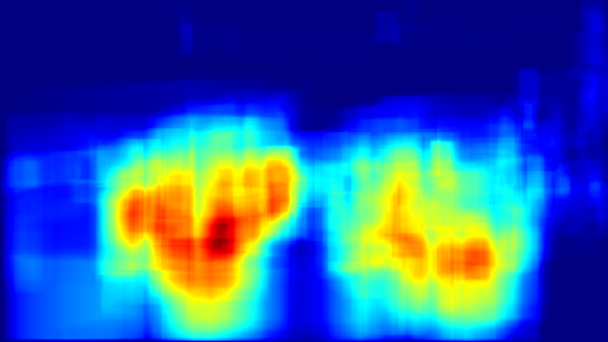

# 🚗 Object Tracking & Analytics Dashboard (YOLOv8 + DeepSORT + Streamlit)

[](https://www.python.org/)
[](https://github.com/ultralytics/ultralytics)
[](https://streamlit.io/)
[](LICENSE)

A **real-time multi-object tracking** and **analytics dashboard** using:
- **YOLOv8** for object detection
- **DeepSORT** for object tracking & ID persistence
- **Streamlit** for an interactive dashboard
- **Heatmaps & CSV reports** for analytics

---

## ✨ Features
✅ **Multi-object tracking** with unique IDs  
✅ **Class-wise color coding** (e.g., people, bikes, cars)  
✅ **Dwell time calculation** for each tracked object  
✅ **Unique object count** & per-class statistics  
✅ **Heatmap generation** for high-traffic zones  
✅ **Streamlit dashboard** for uploads, visualization & downloads  
✅ **Downloadable processed video, CSV logs, and heatmaps**  

---

## 📸 Demo
**Tracking Video (YOLOv8 + DeepSORT)**


**Heatmap Example**


---

## 🛠 Tech Stack
- **Python** (3.10+)
- [YOLOv8 (Ultralytics)](https://github.com/ultralytics/ultralytics)
- [DeepSORT-Realtime](https://pypi.org/project/deep-sort-realtime/)
- [OpenCV](https://opencv.org/)
- [Streamlit](https://streamlit.io/)
- NumPy, Pandas, Matplotlib

---

## 📦 Installation
```bash
# Clone repository
git clone https://github.com/VenerableBrute/object_tracking_dashboard.git
cd object_tracking_dashboard

# Create a virtual environment (recommended)
conda create -n tracking python=3.10 -y
conda activate tracking

# Install dependencies
pip install -r requirements.txt
